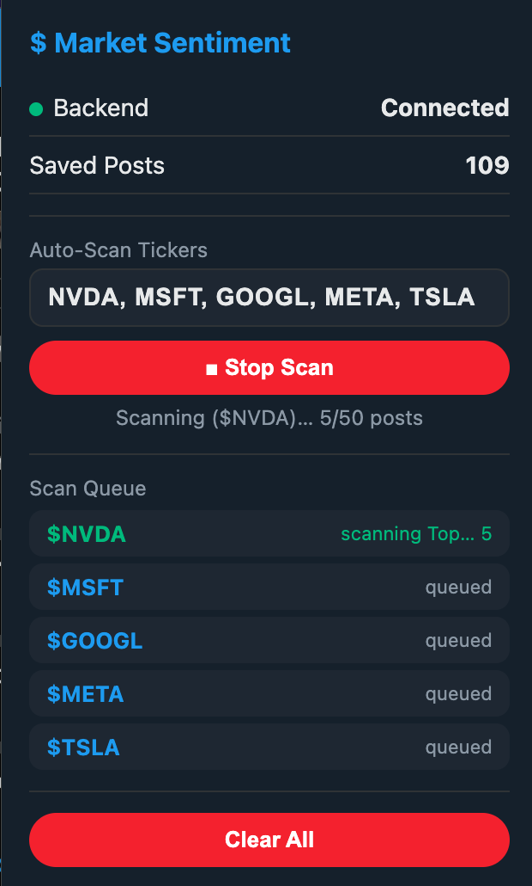
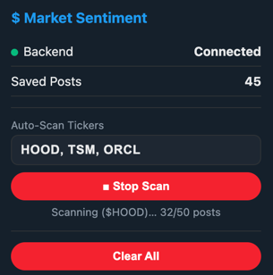
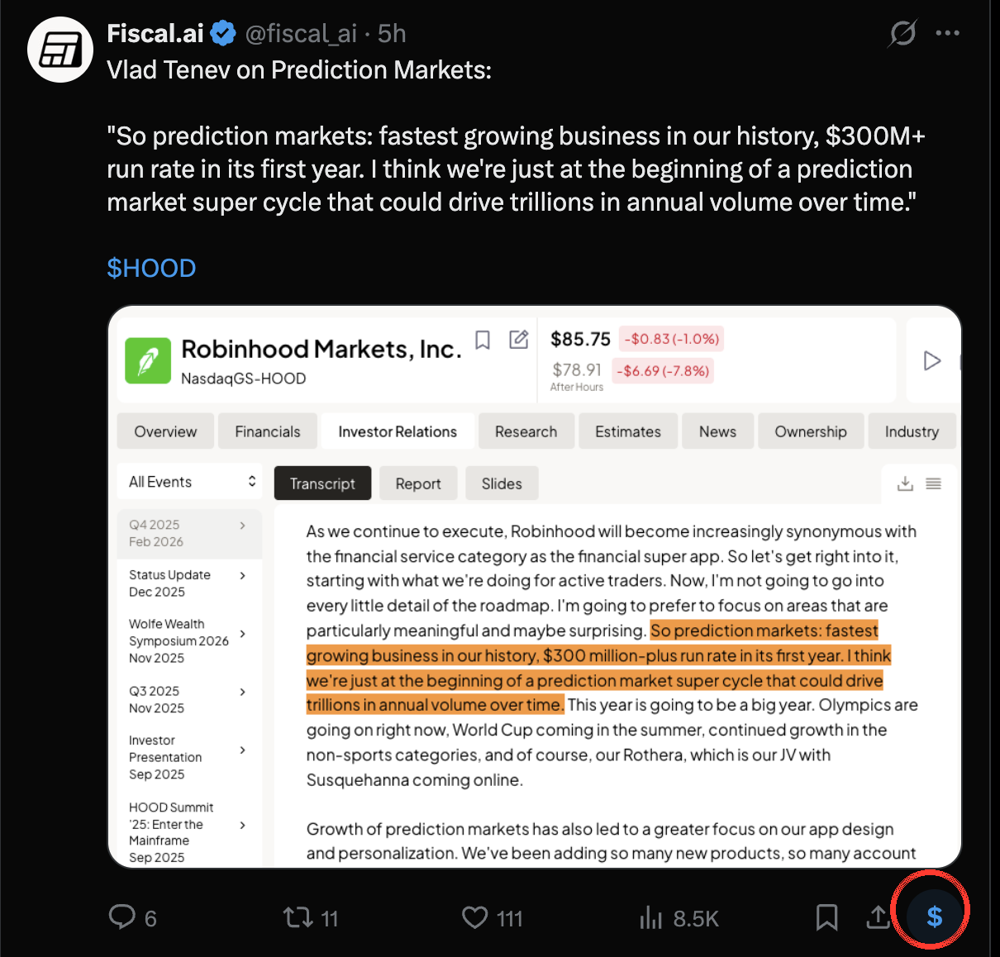
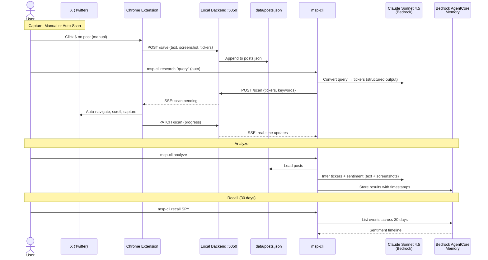

<div align="center">


# Market Sentiment

**Capture posts from X. Run AI sentiment analysis. Feed your agents.**

[](https://www.python.org/downloads/)
[](https://docs.anthropic.com/)
[](https://aws.amazon.com/bedrock/)
[](https://developer.chrome.com/docs/extensions/mv3/)
[](LICENSE)

</div>


> This project is for educational and research purposes only. It does not constitute financial advice. The authors accept no responsibility for any trading losses, damages, or decisions made based on the output of this tool. Use at your own risk.


## What It Does

A Chrome extension + CLI that captures social media posts from X, runs AI-powered sentiment analysis via LLM, and persists structured insights into long-term memory for downstream trading agents.

There are **three ways to capture posts**:

- **[CLI Research](#workflow-1-cli-research)**: One command does it all. Type a query like `"is nvidia overvalued"`, and the CLI figures out the tickers, tells the extension to scan X, runs sentiment analysis, and saves results to memory. Recall later to track sentiment drift over time.
- **[Auto-Scan](#workflow-2-auto-scan-from-chrome-extension)**: Pick your own tickers in the extension popup and let it crawl X search results hands-free.
- **[Manual Capture](#workflow-3-manual-capture)**: Click `$` on individual posts as you browse X to save them one by one.


## Quick Start

### 1. Install

```bash
cd market-sentiment-plugin
pip install -e .
```

### 2. Load Chrome Extension

1. Go to `chrome://extensions`
2. Enable **Developer mode**
3. Click **Load unpacked**
4. Select the `extension/` folder

### 3. Check Setup

```bash
msp-cli doctor
```
```
  Doctor

  Backend      online :5050 (pid 12345)
  Posts         0 saved
  AWS           authenticated (account 1234...)
```


## Workflow 1: CLI Research

Run `msp-cli research` with any question about the market. The CLI sends your query to Claude, which figures out which tickers to search for. It then tells the Chrome extension to scan X for those tickers, collects the posts, runs sentiment analysis, and stores everything in memory.

```bash
msp-cli research "find me what does market feel about top ai companies"
```
```
$ Market Sentiment · Research

  Tickers:   $NVDA $MSFT $GOOGL $META $TSLA
  Keywords:  AI stocks, artificial intelligence, AI sentiment, AI companies, tech AI
  Reason:    Query asks about market sentiment on top AI companies. Selected the 5
             most prominent AI-focused stocks: NVDA, MSFT, GOOGL, META, TSLA.

  Scan queued, waiting for extension...
  Scanning $NVDA   9 posts
  Scanning $MSFT   14 posts
  ...
  Done! 109 posts captured.

  ──────────────── Analyze ────────────────
  $NVDA: bullish 78% (6.2s)
  $MSFT: neutral 55% (4.8s)
  ...
  5 analyzed, stored in memory
```

The extension popup shows the scan queue and live progress:

<p>
  
  <br/>
  <em>The extension auto-populates tickers from the CLI research command and scans them one by one</em>
</p>

Use `--skip-analyze` to skip the auto-analysis step:

```bash
msp-cli research "robinhood stock" --skip-analyze
```


## Workflow 2: Auto-Scan from Chrome Extension

Let the extension crawl X search results automatically, no manual clicking needed.

### Step 1:Open the extension popup

Click the  icon in Chrome's toolbar. Enter one or more tickers (e.g. `HOOD, TSM, ORCL`) and click **Start Scan**.

<p>
  
  <br/>
  <em>The popup shows live progress, 32/50 posts captured for $HOOD</em>
</p>

### Step 2:Extension crawls X automatically

The extension will:
1. Navigate to X search for `$HOOD`
2. Scroll through **Top** results, saving each post + screenshot
3. Switch to **Latest** results, continue saving
4. Move to next ticker (`$TSM`, then `$ORCL`), repeat
5. A blue banner at the top of X shows live progress

Click **Stop Scan** at any time to stop early. Posts captured so far are kept.

### Step 3:Analyze and recall

Once the scan completes:

```bash
msp-cli analyze          # analyze all captured posts
msp-cli recall HOOD      # see sentiment history
msp-cli recall-market    # overall market mood
```


## Workflow 3: Manual Capture

Save individual posts as you browse X.

### Step 1:Click `$` on a post

The extension injects a **$** button into every post's action bar. Click it to save the post text, handle, timestamp, tickers, and a cropped screenshot.

<p>
  
  <br/>
  <em>The $ button appears in the action bar of every post on X</em>
</p>

### Step 2:Analyze

```bash
msp-cli analyze
```
```
  12 posts (10 tagged, 2 untagged)
  $HOOD(8) $AAPL(4)
  $HOOD: bullish 72% (6.4s)
  $AAPL: bearish 58% (4.2s)
  MARKET: bullish 68% risk=moderate (3.1s)
  3 analyzed, stored in memory
```

### Step 3:Recall

```bash
msp-cli recall HOOD
```
```
  $HOOD: 3 memories

  [1] HOOD | 2026-02-10 21:42 | sentiment: bullish 72% | 12 posts
  themes: Prediction markets growth, CEO optimism
  summary: Strong bullish sentiment driven by prediction markets...

  [2] HOOD | 2026-02-10 21:13 | sentiment: bearish 85% | 1 posts
  themes: Q4 2025 earnings miss, sharp price decline
  summary: HOOD dropped 10% after revenue missed expectations...
```

### Step 4:Ask for insight

Run `--ask` to have LLM analyze the full sentiment history for phase changes:

```bash
msp-cli recall HOOD --ask
```
```
  --- Insight ---
  Phase: transitioning  |  Confidence: falling
  Phase changes:
    2026-02-10: bullish -> bearish, Q4 earnings miss, 10% price drop
    2026-02-11: bearish -> bullish, ARK institutional buying, prediction markets thesis

  Sentiment whipsawed around earnings. Bearish spike was event-driven
  but quickly offset by structural bulls citing prediction markets.
  Outlook: Leaning bullish but low conviction, needs follow-through above $85.
```

Or ask a custom question over the history:

```bash
msp-cli recall HOOD --ask "what are the recurring bullish catalysts?"
```


## Sample Analysis Output

<details>
<summary>Per-ticker sentiment JSON</summary>

```json
{
  "sentiment": "bullish",
  "confidence": 72,
  "themes": [
    "Prediction markets growth catalyst",
    "CEO optimism on new business line",
    "Long-term revenue expansion potential"
  ],
  "notable_accounts": ["@fiscal_ai"],
  "summary": "Strong bullish sentiment driven by CEO Vlad Tenev's commentary on prediction markets becoming their fastest growing business with $300M+ run rate in first year.",
  "visual_insights": "Screenshot shows official investor relations transcript highlighting prediction markets as the fastest growing business in Robinhood's history.",
  "noise_filtered": 0,
  "signal_posts": 12
}
```

</details>

<details>
<summary>Market-wide sentiment JSON</summary>

```json
{
  "sentiment": "bullish",
  "confidence": 68,
  "themes": ["tech earnings optimism", "AI infrastructure spend"],
  "risk_appetite": "risk-on",
  "sector_rotation": "tech and AI leading",
  "macro_concerns": "tariff uncertainty",
  "summary": "Overall bullish with risk-on tone. Tech earnings driving sentiment...",
  "noise_filtered": 3,
  "signal_posts": 18
}
```

</details>


## CLI Reference

| Command | Description |
|---------|-------------|
| `msp-cli doctor` | Check backend, AWS creds, setup health |
| `msp-cli start` | Start backend as background daemon |
| `msp-cli stop` | Stop backend daemon |
| `msp-cli serve` | Start backend in foreground (debug mode) |
| `msp-cli research "query"` | LLM-powered research + auto-scan via SSE |
| `msp-cli analyze` | Analyze all saved posts |
| `msp-cli analyze -t SPY` | Analyze single ticker |
| `msp-cli posts` | List saved posts |
| `msp-cli posts -t SPY` | List posts for a ticker |
| `msp-cli clear` | Clear saved posts |
| `msp-cli recall TICKER` | Recall past sentiment (30 days) |
| `msp-cli recall TICKER -q "..."` | Semantic search across memories |
| `msp-cli recall TICKER --ask` | LLM analysis of sentiment shifts + phase changes |
| `msp-cli recall TICKER --ask "custom question"` | Custom LLM question over history |
| `msp-cli recall-market` | Recall overall market mood |


## Requirements

- Python 3.11+
- Google Chrome
- AWS credentials (`aws configure` or `export AWS_ACCESS_KEY_ID=...`)

---

## Architecture



