<div align="center">

```
  ███╗   ███╗  █████╗  ██████╗  ██╗  ██╗ ███████╗ ████████╗
  ████╗ ████║ ██╔══██╗ ██╔══██╗ ██║ ██╔╝ ██╔════╝ ╚══██╔══╝
  ██╔████╔██║ ███████║ ██████╔╝ █████╔╝  █████╗      ██║
  ██║╚██╔╝██║ ██╔══██║ ██╔══██╗ ██╔═██╗  ██╔══╝      ██║
  ██║ ╚═╝ ██║ ██║  ██║ ██║  ██║ ██║  ██╗ ███████╗    ██║
  ╚═╝     ╚═╝ ╚═╝  ╚═╝ ╚═╝  ╚═╝ ╚═╝  ╚═╝ ╚══════╝    ╚═╝

  ███████╗ ███████╗ ███╗   ██╗ ████████╗ ██╗ ███╗   ███╗ ███████╗ ███╗   ██╗ ████████╗
  ██╔════╝ ██╔════╝ ████╗  ██║ ╚══██╔══╝ ██║ ████╗ ████║ ██╔════╝ ████╗  ██║ ╚══██╔══╝
  ███████╗ █████╗   ██╔██╗ ██║    ██║    ██║ ██╔████╔██║ █████╗   ██╔██╗ ██║    ██║
  ╚════██║ ██╔══╝   ██║╚██╗██║    ██║    ██║ ██║╚██╔╝██║ ██╔══╝   ██║╚██╗██║    ██║
  ███████║ ███████╗ ██║ ╚████║    ██║    ██║ ██║ ╚═╝ ██║ ███████╗ ██║ ╚████║    ██║
  ╚══════╝ ╚══════╝ ╚═╝  ╚═══╝    ╚═╝    ╚═╝ ╚═╝     ╚═╝ ╚══════╝ ╚═╝  ╚═══╝    ╚═╝
```

**Save posts from X. Run AI sentiment analysis. Feed your trading agents.**

[](https://www.python.org/downloads/)
[](https://docs.anthropic.com/)
[](https://aws.amazon.com/bedrock/)
[](https://developer.chrome.com/docs/extensions/mv3/)
[](LICENSE)

</div>

---

>This project is for educational and research purposes only. It does not constitute financial advice. The authors accept no responsibility for any trading losses, damages, or decisions made based on the output of this tool. Use at your own risk.


A Chrome extension + local backend that lets you: 
- Captures posts from X (Twitter) as you scroll
- Run AI-powered sentiment + ticker inference on the post marked for analysis
- Persist structured insights into AWS Bedrock AgentCore Memory 
- Feed downstream trading agents or bot with narrative-aware contexts

### What It Actually Does

1. **Capture** — You browse X. See a post about $SPY gamma walls? Click the `$` button injected into the post. The extension grabs the text, handle, timestamp, tickers, and a screenshot, then sends it to a local backend running on `:5050`.

2. **Analyze** — Run `msp analyze`. Claude reads every saved post (text + screenshots). Posts without explicit `$TICKER` tags get tickers inferred by the LLM. Each ticker gets a sentiment verdict (bullish/bearish/neutral + confidence + themes). An overall market mood is computed across all posts.

3. **Store** — Results are persisted into Bedrock AgentCore Memory with timestamps (both post time range and analysis time) so you can track sentiment shifts across sessions.

4. **Recall** — Run `msp recall SPY` anytime to see past sentiment. Or your trading agents (like the 0DTE copilot) can pull crowd sentiment from memory during their analysis loop.

---

## How It Works

```mermaid
sequenceDiagram
    actor User
    participant X as X (Twitter)
    participant Ext as Chrome Extension
    participant API as Local Backend<br/>:5050
    participant FS as data/posts.json
    participant CLI as msp analyze
    participant Claude as Claude Sonnet 4.5<br/>(Bedrock)
    participant Mem as Bedrock AgentCore<br/>Memory

    Note over User,X: Phase 1 — Capture posts while browsing

    User->>X: Browse timeline
    X-->>Ext: Post rendered in DOM
    Ext->>Ext: Inject $ button into post
    User->>Ext: Click $ on interesting post
    Ext->>Ext: Extract text, handle, timestamp,<br/>$TICKER tags, screenshot
    Ext->>API: POST /save {post data + screenshot}
    API->>FS: Append to posts.json
    API-->>Ext: 200 OK (button turns green)

    Note over User,Mem: Phase 2 — AI sentiment analysis

    User->>CLI: msp analyze
    CLI->>FS: Load all saved posts

    rect rgb(40, 40, 60)
        Note over CLI,Claude: Ticker Inference (untagged posts)
        CLI->>Claude: "What tickers are these posts about?"
        Claude-->>CLI: [{index, tickers, reason}, ...]
        CLI->>CLI: Merge inferred tickers into post pool
    end

    rect rgb(40, 50, 40)
        Note over CLI,Claude: Per-Ticker Sentiment
        loop For each $TICKER (e.g. SPY, NVDA, TSLA)
            CLI->>Claude: Posts text + screenshots for $TICKER
            Claude-->>CLI: {sentiment, confidence, themes, summary}
            CLI->>Mem: store_sentiment(ticker, result, timestamps)
        end
    end

    rect rgb(50, 40, 40)
        Note over CLI,Claude: Overall Market Mood
        CLI->>Claude: All posts (cross-ticker)
        Claude-->>CLI: {sentiment, risk_appetite, sector_rotation, macro}
        CLI->>Mem: store_market_sentiment(result, timestamps)
    end

    CLI->>FS: Archive posts, clear active file

    Note over User,Mem: Phase 3 — Recall anytime

    User->>CLI: msp recall SPY
    CLI->>Mem: recall_sentiment("SPY")
    Mem-->>CLI: Historical sentiment entries
    CLI-->>User: SPY: bullish 72% — themes: gamma squeeze, call wall

    Note over Mem: Trading agents can also recall<br/>sentiment during their analysis loop
```



---

## Quick Start

**1. Install**

```bash
cd market-sentiment-plugin
python -m venv .venv && source .venv/bin/activate
pip install -e .
```

**2. Load Chrome Extension**

```
1. Go to chrome://extensions
2. Select Developer mode 
3. Click on Load unpacked 
4. Select `extension/` folder
```

**3. Run**

```bash
# Terminal: start the collector
msp serve

# Browse X, click $ on posts you find interesting...

# When ready, analyze everything
msp analyze
```

**4. Recall later**

```bash
msp recall SPY           # per-ticker history
msp recall-market        # overall market mood
```

---

## CLI Reference

| Command               | Description |
|-----------------------|-------------|
| `msp serve`           | Start collector backend on `:5050` |
| `msp analyze`         | Analyze all saved posts |
| `msp analyze -t SPY`  | Single ticker |
| `msp posts`           | List saved posts |
| `msp clear`           | Clear saved posts |
| `msp recall <Ticker>` | Recall past sentiment from memory |
| `msp recall-market`   | Recall overall market mood |

---

## Requirements

- Python 3.11+
- Google Chrome
- AWS credentials 

---

